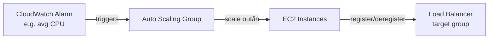

# Section 7 — Elastic Load Balancing & Auto Scaling Groups

Directly the source material behind the [[ECS]] discussion on target groups vs. ASGs — several slides here confirm that reasoning almost word for word.

## Why a load balancer at all
Spreads load across instances, exposes one DNS entry point, absorbs downstream failures, health-checks instances, terminates SSL, supports cookie stickiness, and separates public from private traffic. An **Elastic Load Balancer** is the AWS-managed version — AWS handles upgrades/HA/maintenance, in exchange for fewer configuration knobs than rolling your own.

**Health checks**: done on a port + route (commonly `/health`); anything other than `200 OK` marks the target unhealthy.

## The four load balancer types
| Type | Layer | Protocols | Notes |
|---|---|---|---|
| Classic (CLB, 2009) | — | HTTP/HTTPS/TCP/SSL | Old generation, one SSL cert only |
| **Application (ALB, 2016)** | 7 (HTTP) | HTTP/HTTPS/WebSocket | Path/host/query/header-based routing; great fit for microservices & containers |
| Network (NLB, 2017) | 4 | TCP/TLS/UDP | Extreme performance |
| Gateway (GWLB, 2020) | 3 (IP) | — | Third-party network appliances |

## Application Load Balancer — the one this course actually uses
- Routes to **target groups** based on path (`/users` vs `/posts`), hostname, query string, or headers — this is how one ALB serves multiple backends, same idea as the "one ALB, many services" point in [[ECS]].
- Target group members can be: EC2 instances, **ECS tasks (managed by ECS itself)**, Lambda functions, or private IPs directly.
- **Health checks live at the target-group level**, not the ALB level.
- ALB doesn't forward the client's real IP directly — it's inserted into the `X-Forwarded-For` header (plus `X-Forwarded-Port`/`X-Forwarded-Proto`).

## Cross-zone load balancing
- **ALB**: enabled by default, free, can be disabled per target group.
- **NLB/GWLB**: disabled by default, costs for inter-AZ data if enabled.
- **CLB**: disabled by default, free if enabled.

## SSL/TLS on a load balancer
- Certs managed via **ACM** (or upload your own); HTTPS listener needs a default cert, can add more for multiple domains.
- **SNI (Server Name Indication)** lets one ALB/NLB serve multiple certs for multiple hostnames on a single listener — CLB (old gen) can't do this, needs one CLB per cert.

## Connection draining = deregistration delay
Same feature, different name depending on load balancer generation: **Connection Draining** (CLB) vs **Deregistration Delay** (ALB/NLB) — the window (1–3600s, default 300s) where in-flight requests are allowed to finish before a de-registering/unhealthy target stops receiving new traffic. This is the exact field discussed in [[ECS]]'s target-group breakdown.

## Console walkthrough — registering targets, restricting access, routing rules
Pulled from the hands-on lectures, since these show mechanics the slides only describe abstractly:

- **Manually registering plain EC2 instances into a target group** (no ASG, no ECS involved at all): launch two EC2 instances, create a target group ("group instances together", protocol/port), and explicitly check both instances to register them as targets. This is the third way a target group gets populated, alongside ASG auto-registration and ECS service auto-registration from [[ECS]] — a target group only cares that *something* called `RegisterTargets`, not what.
- **Health checks are genuinely live, not cosmetic**: stopping one of the two registered EC2 instances flips it to unhealthy in the target group within ~30 seconds, and the ALB immediately stops sending it traffic — refreshing the ALB's URL only ever returns the other instance. Restarting it and waiting for the health check to pass again restores it to rotation automatically.
- **Restricting an instance's security group to only the ALB** (the pattern behind [[ECS]]'s target-group section): in the EC2 instance's own security group, delete the broad "HTTP from anywhere" inbound rule and replace it with an HTTP rule whose source is the **load balancer's security group** (typed by name, not a CIDR). After that change, hitting the EC2 instance's public IP directly times out, while hitting it through the ALB still works — because the ALB's own security group is now the only thing allowed in. This is the concrete mechanism for "only let traffic in through the load balancer."
- **ALB listener rules go well beyond simple path routing.** A rule = one or more **conditions** (host header, path, HTTP method, source IP, query string, or HTTP header) plus an **action** (forward to a target group, redirect to a URL, or return a fixed response) plus a **priority** (1 = highest; on a match across multiple rules, highest priority wins). Demoed live: a rule matching path `/error` that returns a fixed 404 response directly from the ALB, with zero involvement from any backend target — useful to know listener rules can short-circuit before ever reaching a target group.
- **SSL/TLS setup in practice**: adding an HTTPS listener means picking a **security policy** (controls which legacy TLS/SSL versions are still accepted) and a certificate source — **ACM** (recommended), **IAM** (not recommended), or pasting in your own private key + cert body + chain to import it straight into ACM. NLB's TLS listener adds one more knob on top: **ALPN** (application-layer protocol negotiation), an advanced setting for negotiating what protocol runs over the TLS connection.

## Auto Scaling Groups
Goal: scale out/in to match load, enforce min/max/desired instance count, auto-register new instances with a load balancer, and replace terminated/unhealthy instances. **ASGs themselves are free** — you only pay for the underlying EC2 instances.

### Launch Template — what it actually holds
AMI + instance type, EC2 User Data, EBS volumes, security groups, SSH key pair, IAM role, network/subnet info, load balancer info, min/max/desired size, and scaling policies. This is the exact object referenced when a service's task or pod needs compute — see [[ECS]]'s ASG↔target-group section and the EKS managed-node-group note below.

### Attaching an ASG to a target group, confirmed hands-on
Creating an ASG offers an **optional load-balancer integration step**: attach it directly to an existing target group, and every instance the ASG launches gets auto-registered (initially `unhealthy` while it's still bootstrapping, then `healthy` once the app is actually serving traffic — this is the ASG's user data script finishing). Health checks here are explicitly **both EC2 status checks and load balancer health checks** — the literal console option behind the "health check type: EC2 vs ELB" distinction: with both enabled, the ASG will terminate and replace an instance the load balancer alone considers unhealthy, even if the EC2 status check looks fine. Scaling desired capacity up or down is visible end-to-end in the **Activity** tab: "launching a new EC2 instance" → it appears in Instance Management → it gets registered into the target group → traffic starts round-robining across it. Scaling down runs the same sequence in reverse — terminate → deregister from the target group.

A telling debugging note from the course: if instances keep cycling (launch → fail health check → terminate → launch again), the two most likely causes are **a security group misconfiguration or a broken EC2 User Data script** — check those before assuming anything more exotic is wrong.

### Scaling policies
- **Target Tracking** — simplest: "keep average CPU at 40%." Confirmed hands-on: creating one auto-generates **two CloudWatch alarms** — `AlarmHigh` (e.g. CPU > 40% for 3 datapoints within 3 minutes → scale out) and `AlarmLow` (e.g. CPU < 28% for 15 datapoints → scale in). The asymmetry is deliberate: scaling out reacts fast, scaling in is deliberately slower/more cautious so you don't flap.
- **Simple/Step Scaling** — CloudWatch alarm crosses a threshold → add/remove N instances (simple: one fixed step; step: multiple tiers, e.g. +1 unit if moderately over, +10 if way over).
- **Scheduled Scaling** — anticipate known patterns (e.g. capacity bump every Friday 5pm) with a start/end time.
- **Predictive Scaling** — machine-learning forecast off a metric (CPU, network in/out, ALB request count, or custom) against a target utilization; needs real historical usage data to be useful, so it's not something you can meaningfully demo in a fresh account.
- Practical load-testing trick shown in the course: SSH/Instance-Connect into the box and run `stress -c 4` (after `yum install stress` on Amazon Linux 2) to peg all 4 vCPUs at 100% and watch the target-tracking alarm actually fire.

