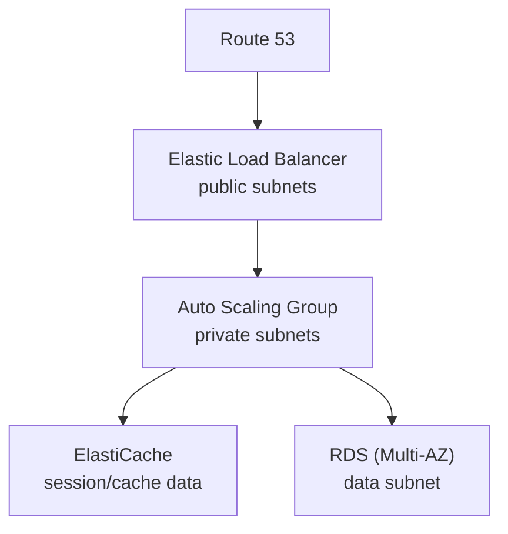

# Section 10 — VPC Fundamentals

Scoped deliberately light in this course — full VPC depth is a Solutions Architect topic, not Developer. Just the pieces a developer needs to recognize.

## Core building blocks
- **VPC** — a private network to deploy resources into; a **regional** resource.
- **Subnet** — partitions the VPC; tied to a single **Availability Zone**. Public subnet = reachable from the internet; private subnet = not. **Route tables** define what's reachable from where.
- **Internet Gateway (IGW)** — lets VPC instances reach the internet; public subnets route to it.
- **NAT Gateway (managed) / NAT Instance (self-managed)** — lets **private** subnet instances reach the internet outbound while staying unreachable inbound.

## Firewalls: NACL vs. Security Group
| | Network ACL | Security Group |
|---|---|---|
| Attached at | Subnet level | ENI / EC2 instance level |
| Rule types | ALLOW **and** DENY | ALLOW only |
| Rule scope | IP addresses only | IP addresses **and** other security groups |

## VPC Flow Logs
Capture IP traffic metadata at the VPC, subnet, or ENI level — including traffic through AWS-managed interfaces (ELB, ElastiCache, RDS, Aurora). Destinations: S3, CloudWatch Logs, or Kinesis Data Firehose. Useful for diagnosing "why can't subnet A reach subnet B" type problems.

## Connecting things together
- **VPC Peering** — private connection between two VPCs, behaving as one network. Requires non-overlapping CIDR ranges, and is **not transitive** — peering A↔B and B↔C does *not* give A↔C.
- **VPC Endpoints** — reach AWS services over AWS's private network instead of the public internet (lower latency, better security). Gateway endpoints: S3 & DynamoDB only. Interface endpoints: most other services.
- **Site-to-Site VPN** — encrypted, but travels over the public internet.
- **Direct Connect (DX)** — a private physical link between on-prem and AWS; faster and more secure, but takes about a month to provision.

## Typical 3-tier architecture (recurring exam pattern)

Public subnets hold the ELB; the app tier (ASG) sits in private subnets across multiple AZs; the data tier (RDS, ElastiCache) sits in an even more isolated data subnet.
