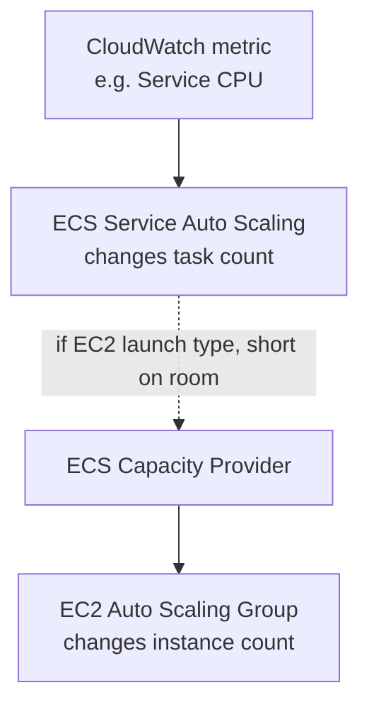
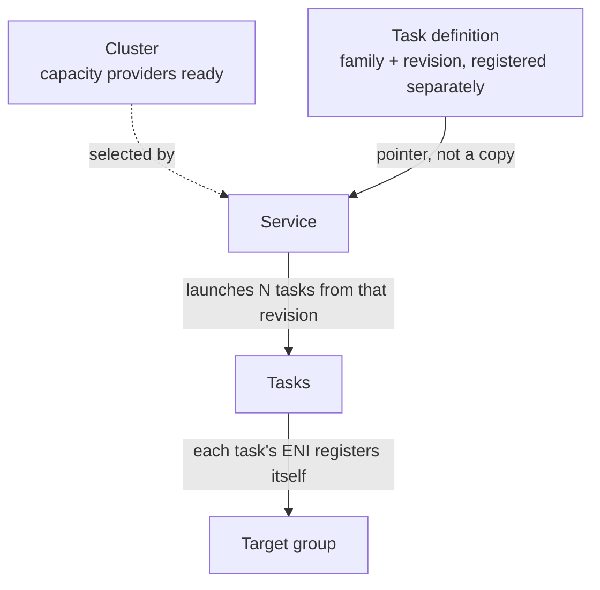

# Section 16 — Containers on AWS: Docker, ECS Internals, EKS

Companion to [[ECS]] — that note covers the ECS/EKS comparison, task/service mechanics, target groups, and console setup in depth from our own working session. This note is what the *course* adds on top: Docker fundamentals, ECS's internal scaling/placement machinery, and EKS specifics. Several slides here directly confirm what we worked out independently in [[ECS]].

## Docker basics
- Packages an app + its environment into a **container** that runs identically on any machine — no compatibility issues, predictable behavior.
- Docker images live in **repositories**: Docker Hub (public) or **Amazon ECR** (private, plus a public gallery).
- Not quite the same as a VM: containers share the host's kernel via the Docker daemon, rather than each running a full guest OS under a hypervisor — this is *why* many containers can run densely on one host.
- Workflow: `Dockerfile` → `docker build` → image → `docker push`/`pull` to/from a repository → `docker run` → running container.

## The four AWS container building blocks
| Service | What it is |
|---|---|
| Amazon **ECS** | AWS's own container orchestration platform |
| Amazon **EKS** | AWS's managed Kubernetes |
| AWS **Fargate** | Serverless compute layer — works underneath *both* ECS and EKS |
| Amazon **ECR** | Where the container images themselves are stored |

(Full ECS-vs-EKS tradeoffs, and where Fargate fits as a compute-layer choice rather than a third orchestrator, are in [[ECS]].)

## ECS Service Auto Scaling ≠ EC2 Auto Scaling
The course draws this line explicitly — the exact distinction from [[ECS]]'s ASG section:

> "ECS Service Auto Scaling (task level) ≠ EC2 Auto Scaling (EC2 instance level)"

- **ECS Service Auto Scaling** (Application Auto Scaling) changes the **number of tasks**, based on: ECS Service average CPU/memory, or **ALB Request Count Per Target**. Modes: Target Tracking, Step Scaling, Scheduled Scaling.
- **EC2 Auto Scaling** (a separate ASG) changes the **number of EC2 instances** underneath an EC2-launch-type cluster.
- The glue between them is the **ECS Cluster Capacity Provider** — paired with an ASG, it automatically adds EC2 instances when the cluster is short on CPU/RAM to place new tasks. Fargate skips this whole layer — "Fargate Auto Scaling is much easier to set up (because Serverless)."

## Rolling updates — min/max percent
When deploying v1→v2, two settings control the rollout:
- **Minimum Healthy Percent** — floor on how many v1 tasks can be torn down before replacements are up.
- **Maximum Percent** — ceiling on how many total tasks (old+new) can exist at once.

Example: min 50% / max 100% with 4 running tasks → ECS can take down up to 2 old tasks at a time before starting replacements. Min 100% / max 150% → ECS must keep all 4 old tasks alive and can spin up 2 *extra* new ones before starting to retire old ones — a more cautious, higher-capacity rollout.

## Event-driven ECS patterns (solutions architectures)
- **EventBridge → run an ECS task** — e.g. an S3 upload event triggers a new Fargate task (with its own task role scoped to just what it needs — S3 read + DynamoDB write).
- **EventBridge Schedule → run an ECS task** — e.g. hourly batch job, no queue involved.
- **SQS → ECS Service polls for messages** — the classic worker-queue pattern; service auto scaling can key off queue depth.
- **EventBridge on task-stopped events** — intercept a crashed/stopped task and notify (e.g. SNS → email an admin).

## Console walkthrough — the full ECS setup, in the order you actually do it

This is the piece that was missing before: not just *what fields exist*, but *what order you configure them in, and how each step's output becomes the next step's input*. Pulled directly from the three hands-on lectures (168, 169, 174).

### Step 1 — Create the cluster (lecture 168)
EC2 → ECS → Clusters → Create cluster:
1. **Cluster name** (e.g. `DemoCluster`).
2. **Infrastructure** — four choices now: Fargate only / Fargate + Managed Instances (AWS runs the EC2s for you — you create an instance profile + infrastructure role for it) / Fargate + Self-managed instances (you own the ASG) / EC2 only. The course demos self-managed, "to stay compatible with older lectures."
3. If self-managed EC2 is included: pick an **Auto Scaling group** (new or existing) — this is where the launch template, AMI, and min/max/desired from [[07 - ELB and ASG]] get wired in.
4. Optional: Monitoring (Container Insights), Encryption (KMS key for storage).
5. Click **Create cluster**.

**What you get immediately, before creating anything else**: the cluster already shows **three capacity providers** — `FARGATE`, `FARGATE_SPOT`, and one backed by the ASG you just created (e.g. `Infra-ECS-Cluster`, min 0 / max 5). Nothing is running yet — a cluster with zero services and zero tasks still has these three capacity *options* sitting there, ready to be drawn on.

### Step 2 — Register a task definition (lecture 174) — *this can happen before or during Step 3*
ECS → Task definitions → Create new task definition. This is a **separate object from the cluster and the service** — it's account/region-scoped, not cluster-scoped, and nothing runs yet just from creating one. Fields, in console order:
1. **Task definition family** (e.g. `nginxdemos-hello`) — the name; every time you re-register under this family, ECS adds a new revision number underneath it (`nginxdemos-hello:1`, `:2`, ...).
2. **Launch type** — AWS Fargate / EC2 / External. Forces `networkMode: awsvpc` if Fargate is selected; EC2-only definitions can use a different (non-awsvpc) network mode.
3. **Task size** — CPU + memory *for the whole task*, required for Fargate.
4. **Task role** — the IAM role your *application code* assumes at runtime. Explicitly called out in the course as "of utmost importance if your containers need to use AWS" (e.g. read from S3) — skipped in the quick demo, but this is the field to fill in for anything real.
5. **Task execution role** — the IAM role the *ECS agent itself* needs (pull the image, write logs). ECS auto-creates one named `ecsTaskExecutionRole` the first time you need it, if it doesn't already exist.
6. **Container definitions** — one entry per container (up to 10):
   - Name, image URI.
   - **Essential** toggle — if this container dies, an essential one takes the whole task down with it; a non-essential one doesn't.
   - **Port mappings** — container port + protocol, where protocol can be HTTP, HTTP/2, gRPC, or none.
   - **Environment variables** — from four sources: hardcoded, SSM Parameter Store, Secrets Manager (by ARN), or a bulk env file sitting in S3.
   - **Logging** — via **AWS FireLens**, which can ship to CloudWatch, Splunk, Firehose, Kinesis Data Streams, OpenSearch, or S3 — not just plain `awslogs`.
   - **Health check** — separate start timeout (killed if it doesn't come up fast enough) and stop timeout (killed if it doesn't shut down fast enough).
   - **Storage** — bind mount (ephemeral, shared between containers in the same task) or an EFS mount, with a container path to mount it at. This is the mechanism behind the sidecar pattern — a log-shipping or metrics container reading a shared mount the app container writes to.
   - **Tracing** — an ADOT (AWS Distro for OpenTelemetry) sidecar can be added to ship traces to X-Ray and metrics to CloudWatch/Managed Prometheus; ECS automatically pads the task's CPU/memory to account for it.
7. Click **Create** — this registers `nginxdemos-hello:1`. Still nothing running.

### Step 3 — Create the service (lecture 169) — this is where task definition and cluster actually meet
ECS → Clusters → [`DemoCluster`] → Create service. This screen is the join point: it takes the cluster from Step 1 and a task definition (either the one from Step 2, or one you define inline right here) and produces running tasks. Fields, in order:
1. **Task definition** — a dropdown of existing **families**, plus "Create new task definition revision" if you'd rather define one inline without leaving this screen (this is what the quick demo does — typing family name, image, size, roles right into the service wizard instead of visiting Task Definitions first). Either path lands you on the same object: a family + revision number.
2. **Revision** — pick a specific number, or "latest." This is the literal answer to "how does the task definition come into the picture": the service doesn't hold a copy of the task definition, it holds a **pointer to one family+revision**, and every task it creates from that point on is stamped from exactly that revision.
3. **Service name**, **Desired tasks count** (e.g. 1, then bumped to 3 later to watch it scale).
4. **Networking** — VPC/subnets, a security group (new one created in the demo), and whether tasks get a public IP.
5. **Load balancing** (optional) — pick or create a target group here (see [[ECS]] for the full "one console page creates three resources" breakdown of this exact step: a new ALB, a new listener, and a new target group all get created together if none exist yet). This is the same screen behind the `DemoALBForECS` example from our own session.
6. Click **Create**.

### Step 4 — What actually happens (confirmed live)
- The service reads its pointer (family + revision) and immediately launches **desired-count** tasks from it.
- Each task's ENI IP gets **registered directly into the target group** — no ASG involved on the Fargate path (matches [[ECS]]'s asymmetry point exactly). The target group shows one entry per running task.
- Bumping desired count from 1 → 3 provisions two more tasks within seconds, each with its own registered IP; refreshing the ALB's URL round-robins across all three.
- Scaling back down deregisters and stops tasks in the same direction, in reverse.

## Task Placement (EC2 launch type only — Fargate doesn't need this)
When ECS places a task on an EC2-backed cluster, it filters candidate instances in order: (1) CPU/memory/port fit → (2) placement **constraints** → (3) placement **strategy** → (4) pick.

| Strategy | Behavior |
|---|---|
| **Binpack** | Pack onto the *least* available CPU/RAM — minimizes instance count, saves cost |
| **Random** | No preference |
| **Spread** | Even distribution across a dimension (e.g. `instanceId`, AZ) — maximizes resilience |

Strategies can be mixed. **Constraints**: `distinctInstance` (never co-locate two tasks on one instance) or `memberOf` (match a Cluster Query Language expression).

## Amazon EKS — the details behind the tradeoffs in [[ECS]]
- Managed Kubernetes; same goal as ECS, different (portable, standard) API. Kubernetes itself is cloud-agnostic.
- Multi-region = one EKS cluster **per region** (no such thing as a multi-region cluster).
- Logs/metrics via CloudWatch Container Insights.

### Node types — this is the slide that confirms the ASG/AMI conversation directly
- **Managed Node Groups** — EKS creates and manages the nodes for you; **"Nodes are part of an ASG managed by EKS."** Supports On-Demand or Spot.
- **Self-Managed Nodes** — you create the nodes and register them to the cluster yourself, still backed by an ASG you own; typically built from the **Amazon EKS-Optimized AMI**.
- **Fargate** — no nodes at all to think about.

This is exactly the layer discussed in [[ECS]]'s Fargate/compute-funnel section: whether AWS or you own the ASG, an EKS *node group* is still fundamentally "an ASG running a particular AMI" underneath — Fargate is what removes that layer entirely.

### EKS data volumes
Needs a `StorageClass` manifest + a CSI-compliant driver. Supported backends: EBS, EFS (works with Fargate), FSx for Lustre, FSx for NetApp ONTAP.
