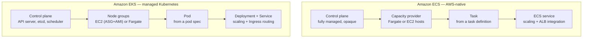
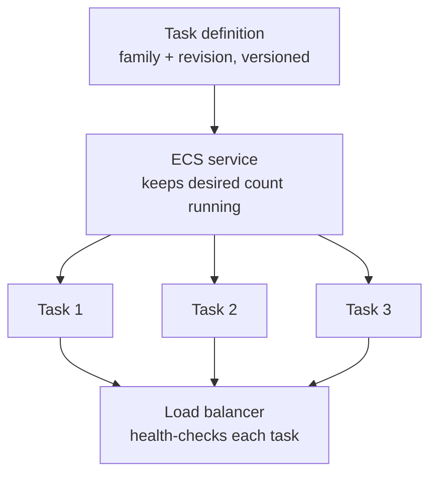
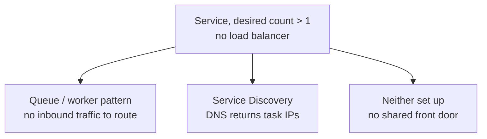
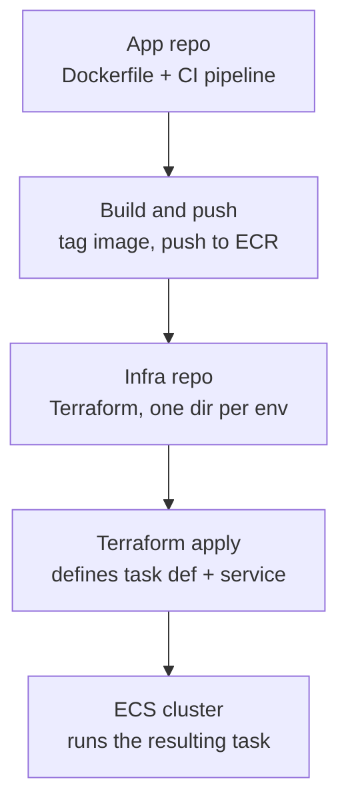
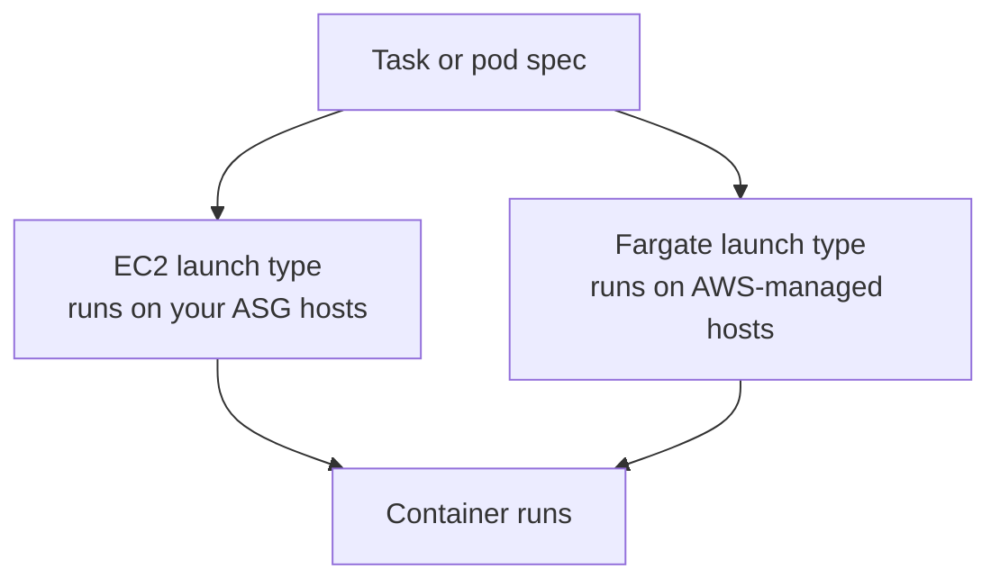
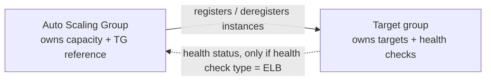
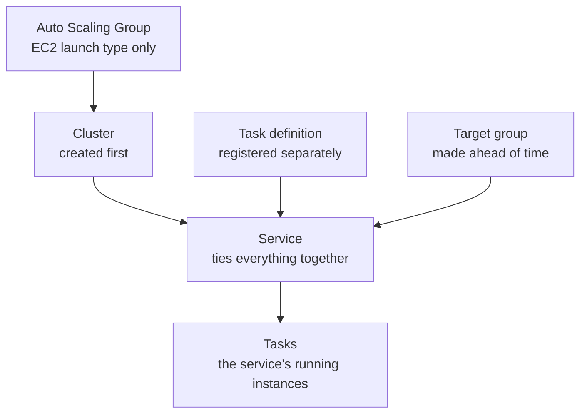
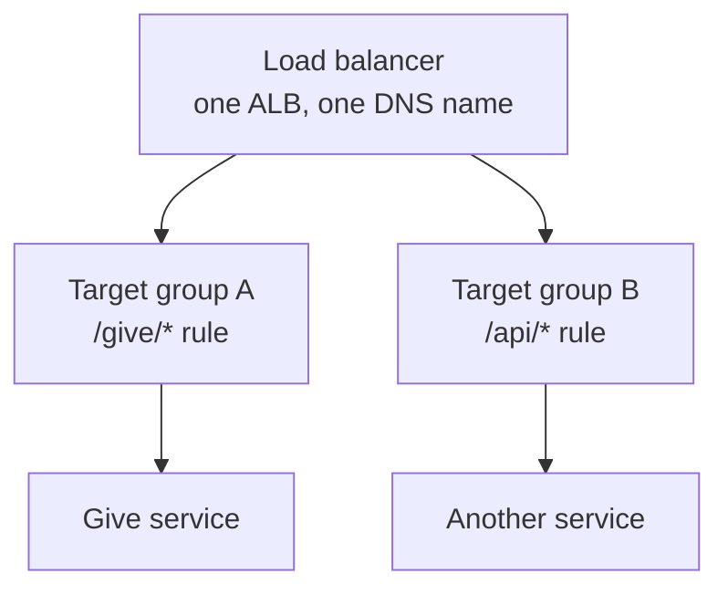

# Amazon ECS

Companion note to [[Kubernetes]] — same underlying problem (orchestrate containers across a fleet), different ownership model. Built from a working session comparing ECS against EKS, using real examples from [[TIFIN]] repos (`devtools_root/devtools/ecs_connect.sh`, `louise-backend/.gitlab-ci.yml`).

## 1. ECS vs EKS — the core distinction

- **ECS**: AWS's own proprietary orchestrator. Control plane, scheduler, state store are entirely AWS-internal — invisible, uninspectable, accessed only via the ECS API/CLI.
- **EKS**: AWS running a *real Kubernetes control plane* for you (API server, etcd, controller-manager, scheduler — the same components from the Kubernetes note). Still fully Kubernetes underneath — `kubectl`, CRDs, Helm charts all work normally.



### K8s vocabulary → ECS equivalent

| K8s concept | ECS equivalent | Notes |
|---|---|---|
| Cluster (control plane + nodes) | Cluster | In ECS, "cluster" is mostly a logical namespace — no control plane you manage |
| Pod spec | Task definition | JSON not YAML; same idea — containers, images, limits, env vars |
| Pod (running instance) | Task | A running instantiation of a task definition |
| Deployment + Service | ECS Service | One object does both replica management and LB registration |
| Ingress / Service (external) | ALB/NLB target group | Routing delegated entirely to a real load balancer |
| Kubelet / node | Container instance (EC2) or nothing (Fargate) | Fargate removes the node concept entirely |
| Scheduler | Capacity provider strategy | Not pluggable — no custom scheduler extensions |
| `kubectl exec` | `aws ecs execute-command` | Same idea, different CLI |
| ConfigMap / Secret | Task def env vars / SSM & Secrets Manager refs | No native ConfigMap object |

**Worth being precise about that "Deployment + Service" row**: ECS's "Service" isn't really the analogue of Kubernetes' *Service* — it's much closer to Kubernetes' **Deployment**. The mandatory job (keep N tasks alive, replace failures, roll deployments) is Deployment's job in K8s. The optional job (wire tasks to a load balancer) is Service's job in K8s. ECS just bundled both responsibilities into one object and reused the word "Service" for it. The consequence, stated plainly: **a task can run with zero ECS service involved at all.** `aws ecs run-task` launches one directly — no babysitting, no desired count, no self-healing — the ECS equivalent of a bare Pod or a one-shot Job in K8s. A service is only required if you want the *managed, continuously-running* behavior, not for a task to run at all.

### Tradeoffs

| Factor | ECS | EKS |
|---|---|---|
| Control plane ops | Zero, invisible | Managed, but you own node patching/upgrades unless full Fargate |
| Learning curve | Shallow, AWS-native only | Steep — full K8s API surface |
| Portability | None | High — same manifests run anywhere K8s does |
| Ecosystem | Small, AWS-native tooling | Massive — Helm, Operators, service mesh, ArgoCD |
| Vendor lock-in | High | Lower, not eliminated |
| Cost at small scale | No control-plane fee | ~$0.10/hr flat EKS control-plane fee |
| Hiring pool | Narrow, AWS-specific | Wide, transfers everywhere |
| Multi-cloud | Not viable | The default if ever needed |
| Day-2 ops load | Low | Higher — upgrades, add-on compat, IRSA/RBAC |

**Decision drivers**: team already K8s-fluent → EKS pays for itself. Small team wants AWS to disappear → ECS + Fargate. Portability/multi-cloud a real future need → EKS, non-negotiable (ECS is a one-way door). Need service mesh/canary/custom operators → EKS's ecosystem wins by a wide margin.

## 2. Task, Task Definition, and Service

| Term | What it is | Lifespan |
|---|---|---|
| **Task definition** | JSON blueprint — image, CPU/memory, ports, env vars, roles. Never runs anything itself; each save bumps a revision number | Static, versioned, immutable once registered |
| **Task** | One running instantiation of a task definition | Ephemeral |
| **Service** | Long-running manager: keeps N tasks of a task-def revision alive, registers them with a target group, replaces unhealthy ones, rolls forward on new revisions | Persists until deleted |



A task definition doesn't "do" anything by itself — nothing runs until a **service** (continuous) or `run-task` (one-off, e.g. a DB migration) asks ECS to launch from it.

### Running a service without a load balancer
Load balancing is optional on a service — what actually happens without one depends entirely on the workload:



- **Queue/worker pattern** — tasks pull from SQS or react to EventBridge independently. There's no inbound traffic to route in the first place, so no LB is needed; whichever task polls next gets the work. Naturally load-balanced by the queue itself, not by ECS.
- **Service Discovery (AWS Cloud Map / ECS Service Connect)** — the real alternative to an ALB, for internal traffic. Registers each task into a private DNS namespace; a caller resolves a name and gets back the current healthy task IPs (multiple DNS records, or routed through Service Connect's built-in proxy). Client-side/DNS-based load balancing instead of a server-side listener — the normal choice for service-to-service calls that never leave the VPC.
- **Neither** — if the tasks need to be reached externally and there's no LB and no service discovery, there's no shared, stable way in. Each task has its own IP that changes on every replacement; the only path left is calling `DescribeTasks` yourself to find current IPs. Fine for a one-off script, not something to build real traffic on — which is why, in practice, skipping load balancing almost always means one of the first two cases, not this one.

### Real example — `louise-backend/.gitlab-ci.yml`

- `SERVICENAME` vars (`elevatedemo-give-test-service`, `rbt-give-release-celery-service`) are **services**, not task definitions.
- Two services per env (web + celery) because a web process and a celery worker scale on completely different signals, even off the same image.
- `aws ecs update-service --force-new-deployment` operates on the **service** — cycles tasks without minting a new task-definition revision, used for the simpler "lab dev" env deploys.
- Prod/UAT instead runs `terraform apply` against a shared module `give_ecs_service`, one directory per environment, injecting `TF_VAR_give_docker_image` — **the app repo only builds & pushes the image; a separate infra repo owns the actual task definition + service.**



### Example task definition (Fargate)

```json
{
  "family": "louise-give",
  "networkMode": "awsvpc",
  "requiresCompatibilities": ["FARGATE"],
  "cpu": "512",
  "memory": "1024",
  "executionRoleArn": "arn:aws:iam::...:role/ecsTaskExecutionRole",
  "taskRoleArn": "arn:aws:iam::...:role/louiseGiveTaskRole",
  "containerDefinitions": [{
    "name": "give",
    "image": "...dkr.ecr.us-east-2.amazonaws.com/give-release:v1.2.3",
    "essential": true,
    "portMappings": [{ "containerPort": 9000, "protocol": "tcp" }],
    "secrets": [{ "name": "DB_PASSWORD", "valueFrom": "arn:aws:ssm:...:parameter/louise/prod/db_password" }],
    "logConfiguration": { "logDriver": "awslogs", "options": { "awslogs-group": "/ecs/louise-give-prod" } }
  }]
}
```
- `executionRoleArn` = permissions the ECS **agent** needs (pull image, write logs) vs `taskRoleArn` = permissions the **app code** assumes at runtime.
- `secrets` (pulled from SSM at launch) vs `environment` (plaintext, baked in).

## 3. Fargate — a compute-layer choice, not a third orchestrator

"ECS vs EKS" and "EC2 vs Fargate" are **independent axes**. All four combinations exist. Fargate = serverless compute: declare `cpu`/`memory` per task, AWS runs it with no EC2 instance, no ASG, no AMI to manage. Mandatory `networkMode: awsvpc` — every task gets its own ENI + private IP.



## 4. ASG vs Target Group — asymmetric relationship

The **ASG holds a reference to the target group**. The target group holds **no reference back**. One-way pointer, not mutual.

| | Auto Scaling Group | Target group |
|---|---|---|
| Own config | Launch template, min/max/desired, scaling policies, subnets | Target type (`instance`/`ip`/`lambda`), protocol/port, health check |
| Stores about the other | A list of target-group ARNs ("Load balancing" section) | Nothing — no idea who registered a target |
| Active behavior | On launch → `RegisterTargets`; on terminate → `DeregisterTargets` | Continuously health-checks whatever is currently registered |



The Targets tab is a flat, source-agnostic list — an entry could come from an ASG, from an ECS service registering a Fargate task's ENI IP directly (no ASG involved at all on Fargate), or a manual registration. On EC2-launch-type ECS, it's **ECS itself**, not the ASG, that calls RegisterTargets/DeregisterTargets as tasks land.

**ASG health check type** (`EC2` default vs `ELB`) controls whether the ASG defers to the target group's health check when deciding to replace an instance — opt-in, not automatic.

## 5. Console setup order (no Terraform)

Dependency rule: anything *referenced* must exist before the thing referencing it.



1. **Cluster** — name, infrastructure (Fargate/EC2/External). Ticking "EC2 instances" is what silently creates the ASG + capacity provider. AWS now also offers a fourth option, **"Fargate and Managed Instances"** — a middle ground where AWS still manages the underlying EC2 instances for you (behind an instance profile + infrastructure role you create), so you get real EC2 hosts without owning the ASG/AMI layer yourself. A freshly created cluster shows three capacity providers by default: `FARGATE`, `FARGATE_SPOT`, and one backed by the cluster's own ASG — see [[AWS Certified Developer/16 - Containers, ECS Internals, EKS]] for a walked-through example.
2. **Task definition** — family, launch-type compatibility, task CPU/memory, task role vs execution role, container definitions.
3. **Target group** (before the service) — target type `ip` for Fargate/awsvpc, protocol/port, health check, **deregistration delay** (connection-draining window before a deregistering target is fully pulled from rotation — default 300s).
4. **Load balancer + listener** — references the target group from step 3.
5. **Service** — references cluster (1), task def (2), target group (3); deployment config, networking, optional service auto scaling.
6. **Scaling policy** — target-tracking, e.g. `ALBRequestCountPerTarget`.

### The launch-type funnel — same word, three narrowing questions

| Level | Console field | Decides |
|---|---|---|
| Cluster | "Infrastructure" | Which capacity pools exist at all (tick any combo — doesn't force exclusivity) |
| Task definition | "Launch type compatibility" (`requiresCompatibilities`) | Which pools this blueprint is *allowed* on — a declaration, not a commitment |
| Service | "Launch type" / capacity provider strategy | The actual, binding choice for every task this service creates |

Each level must be compatible with the one above it; AWS rejects the service at creation time on a mismatch.

### The ECS "create service" wizard bundles 3 resources into 1 page
Fields grouped "Load balancer name" / "Listener" / "Target group" on one screen aren't all target-group config — that page creates a **new ALB**, a **new listener**, and a **new target group** in one shot, purely for greenfield convenience. Pick "use an existing" for any of the three and the corresponding fields collapse into a plain dropdown.

## 6. One ALB can serve many services

An ALB is shared, reusable infrastructure — not inherently 1:1 with a service. Add another listener rule + target group to route a different path to a different ECS service on the *same* ALB/DNS name.



Per-request routing (round robin by default, or "least outstanding requests" if configured) is a **separate mechanism** from task-count scaling (service auto scaling reacting to load) — the ALB itself doesn't know or care about overall traffic volume, it just spreads requests across whatever healthy targets currently exist.
