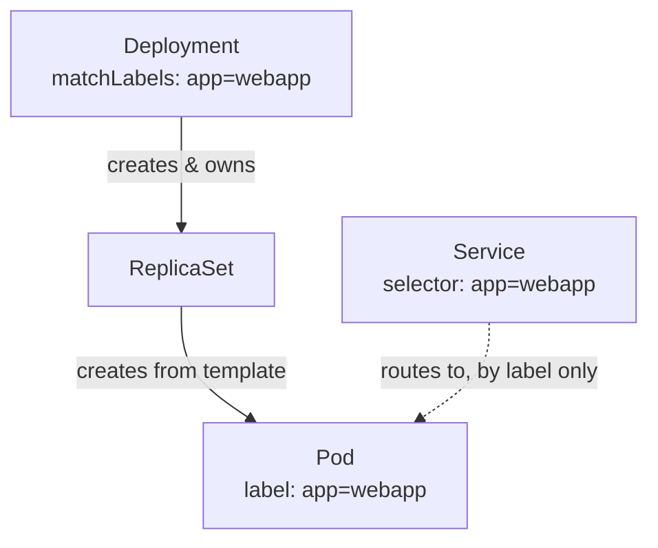

# Kubernetes

https://notebooklm.google.com/notebook/4203adc6-be82-48eb-9f2a-419879d89c68

![[NotebookLM_Mind_Map_(1).png]]

This summary serves as a comprehensive "cheat sheet" for the **Kubernetes Crash Course** by TechWorld with Nana. It covers the core architecture, essential components, and the hands-on workflow.

### **1. Core Concepts & "Why Kubernetes?"**

- **Definition:** An open-source container orchestration framework (originally by Google) used to manage hundreds or thousands of containers across different environments [[01:45](http://www.youtube.com/watch?v=s_o8dwzRlu4&t=105)].
- **Key Problems Solved:**
    - **High Availability:** Ensures no downtime for users [[03:32](http://www.youtube.com/watch?v=s_o8dwzRlu4&t=212)].
    - **Scalability:** Easily scales applications up or down based on load [[03:41](http://www.youtube.com/watch?v=s_o8dwzRlu4&t=221)].
    - **Disaster Recovery:** Mechanisms to back up and restore data to the latest state [[04:03](http://www.youtube.com/watch?v=s_o8dwzRlu4&t=243)].

### **2. Kubernetes Architecture (The Cluster)**

A cluster consists of at least one **Master Node** and multiple **Worker Nodes** [[04:40](http://www.youtube.com/watch?v=s_o8dwzRlu4&t=280)].

- **Worker Node:** Where applications run. Contains:
    - **Kubelet:** A process that allows the node to communicate with the cluster and execute tasks [[04:49](http://www.youtube.com/watch?v=s_o8dwzRlu4&t=289)].
- **Master Node (Control Plane):** Manages the cluster state. Key processes:
    - **API Server:** The entry point for all clients (UI, CLI, API) [[05:41](http://www.youtube.com/watch?v=s_o8dwzRlu4&t=341)].
    - **Controller Manager:** Monitors the cluster and handles repairs (e.g., restarting dead containers) [[06:12](http://www.youtube.com/watch?v=s_o8dwzRlu4&t=372)].
    - **Scheduler:** Decides which worker node should run a new container based on resources [[06:27](http://www.youtube.com/watch?v=s_o8dwzRlu4&t=387)].
    - **etcd:** A key-value store that acts as the "cluster brain," holding the current state/configuration [[06:54](http://www.youtube.com/watch?v=s_o8dwzRlu4&t=414)].
- **Virtual Network:** Spans all nodes, allowing them to communicate and act as one powerful machine [[07:36](http://www.youtube.com/watch?v=s_o8dwzRlu4&t=456)].

### **3. Main Kubernetes Components**

- **Pod:** The smallest unit. An abstraction over a container. Usually runs one application container [[09:48](http://www.youtube.com/watch?v=s_o8dwzRlu4&t=588)].
- **Service:** A permanent IP address for pods. It acts as a **Load Balancer** and ensures communication persists even if a pod dies and gets a new internal IP [[12:21](http://www.youtube.com/watch?v=s_o8dwzRlu4&t=741)].
    - **Internal Service:** For database/back-end pods [[13:15](http://www.youtube.com/watch?v=s_o8dwzRlu4&t=795)].
    - **External Service:** Opens communication to the public (e.g., via NodePort) [[13:08](http://www.youtube.com/watch?v=s_o8dwzRlu4&t=788)].
- **Ingress:** Routes traffic into the cluster using secure protocols and domain names instead of just IP/ports [[14:03](http://www.youtube.com/watch?v=s_o8dwzRlu4&t=843)].
- **ConfigMap & Secret:**
    - **ConfigMap:** External configuration (URLs, endpoints) so you don't have to rebuild images for small changes [[15:37](http://www.youtube.com/watch?v=s_o8dwzRlu4&t=937)].
    - **Secret:** Similar to ConfigMap but for sensitive data (passwords, certs), stored in Base64 [[16:39](http://www.youtube.com/watch?v=s_o8dwzRlu4&t=999)].
- **Volumes:** Attaches physical storage to pods to ensure data persistence if a container restarts [[18:28](http://www.youtube.com/watch?v=s_o8dwzRlu4&t=1108)].
- **Deployments vs. StatefulSets:**
    - **Deployment:** A blueprint for **stateless** apps. Manages replicas and scaling [[21:25](http://www.youtube.com/watch?v=s_o8dwzRlu4&t=1285)].
    - **StatefulSet:** Used for **stateful** apps like databases (MySQL, MongoDB) to manage data consistency and synchronization [[23:09](http://www.youtube.com/watch?v=s_o8dwzRlu4&t=1389)].

### **4. Configuration & Deployment Workflow**

- **YAML Files:** Configuration is **declarative**—you define the "desired state," and Kubernetes works to match the "actual state" (self-healing) [[28:01](http://www.youtube.com/watch?v=s_o8dwzRlu4&t=1681)].
- **Selectors & Labels:** Labels are key-value pairs used to identify and group components. **Selectors** are used by Services and Deployments to find the specific pods they manage [[49:09](http://www.youtube.com/watch?v=s_o8dwzRlu4&t=2949)].
- **MiniKube & Kubectl:**
    - **MiniKube:** A tool to run a one-node K8s cluster locally for testing [[33:46](http://www.youtube.com/watch?v=s_o8dwzRlu4&t=2026)].
    - **Kubectl:** The Command Line Interface (CLI) to interact with any K8s cluster [[34:25](http://www.youtube.com/watch?v=s_o8dwzRlu4&t=2065)].

### **4a. Deployment & Service YAML — Field by Field**

The course's companion repo ([k8s-in-1-hour](https://gitlab.com/nanuchi/k8s-in-1-hour)) has the actual `mongo.yaml` and `webapp.yaml` walked through in this segment [[21:25](http://www.youtube.com/watch?v=s_o8dwzRlu4&t=1285)]–[[49:09](http://www.youtube.com/watch?v=s_o8dwzRlu4&t=2949)]. Worth having the real fields in front of you:

**Deployment half of `webapp.yaml`:**
```yaml
apiVersion: apps/v1
kind: Deployment
metadata:
  name: webapp-deployment
  labels:
    app: webapp
spec:
  replicas: 1
  selector:
    matchLabels:
      app: webapp        # must match template labels below
  template:
    metadata:
      labels:
        app: webapp
    spec:
      containers:
        - name: webapp
          image: nanajanashia/k8s-demo-app:v1.0
          ports:
            - containerPort: 3000
          env:
            - name: USER_NAME
              valueFrom:
                secretKeyRef:
                  name: mongo-secret
                  key: mongo-user
```
- `spec.replicas` — how many Pod copies the Deployment keeps alive.
- `spec.selector.matchLabels` — the label the Deployment uses to claim its own Pods. Must match `spec.template.metadata.labels` exactly, or the Deployment can't find what it created.
- `spec.template` — the actual Pod blueprint; everything under it gets stamped onto every replica.
- `env[].valueFrom.secretKeyRef` / `configMapKeyRef` — pulls a value from a Secret or ConfigMap by name+key at Pod startup instead of hardcoding it. This is the actual mechanism behind the ConfigMap/Secret bullet above.

**Service half of `webapp.yaml`:**
```yaml
apiVersion: v1
kind: Service
metadata:
  name: webapp-service
spec:
  type: NodePort
  selector:
    app: webapp          # same label, no reference to the Deployment itself
  ports:
    - port: 3000
      targetPort: 3000
      nodePort: 30000
```
- `spec.selector` — the field that actually connects a Service to Pods, and it's just a label match, same as the Deployment used. A Service has no idea what Deployment created a Pod; it only looks at labels.
- `port` vs `targetPort` — `port` is what other things inside the cluster call the Service on; `targetPort` is the port the container actually listens on inside the Pod. Often the same number, but don't have to be.
- `nodePort` — only present because `type: NodePort`; the port opened on every Node's IP for external access, matching the External Access note above.

`mongo.yaml`'s Service omits `type` entirely (defaults to `ClusterIP`) and has no `nodePort` — the database is only ever meant to be reached from inside the cluster, matching the Internal/External Service distinction above.

**The one thread tying all three together is label matching, not any direct reference:**

A Deployment finds its own Pods by label. A Service finds its target Pods by the same *kind* of label match — done completely independently. Change a Pod's label without updating both the Deployment's `matchLabels` and the Service's `selector`, and either relationship can silently break.

### **5. Useful Kubectl Commands (Quick Reference)**

- `kubectl apply -f [filename].yaml`: Create or update components [[01:04:55](http://www.youtube.com/watch?v=s_o8dwzRlu4&t=3895)].
- `kubectl get all`: List pods, services, and deployments [[01:05:48](http://www.youtube.com/watch?v=s_o8dwzRlu4&t=3948)].
- `kubectl describe [type] [name]`: Get detailed info about a specific component [[01:07:43](http://www.youtube.com/watch?v=s_o8dwzRlu4&t=4063)].
- `kubectl logs [pod_name]`: View container logs for debugging [[01:08:36](http://www.youtube.com/watch?v=s_o8dwzRlu4&t=4116)].
- `minikube ip`: Get the IP of your local cluster to access external services [[01:09:35](http://www.youtube.com/watch?v=s_o8dwzRlu4&t=4175)].

---

**Conversation Highlights & Clarifications:**

- **Stateful vs. Stateless:** You might have wondered why we don't just use Deployments for everything. The video emphasizes that **StatefulSets** are necessary for databases because they ensure that even if a pod is moved or restarted, it maintains its specific identity and connects to the correct storage [[23:09](http://www.youtube.com/watch?v=s_o8dwzRlu4&t=1389)].
- **The Three Parts of YAML:** Every K8s config has **Metadata**, **Specification** (your desired state), and **Status** (automatically generated by K8s to track actual state) [[28:42](http://www.youtube.com/watch?v=s_o8dwzRlu4&t=1722)].
- **External Access:** To see your app in a browser, you must use a **NodePort** (range 30000–32767) or **Ingress** [[01:02:41](http://www.youtube.com/watch?v=s_o8dwzRlu4&t=3761)].
