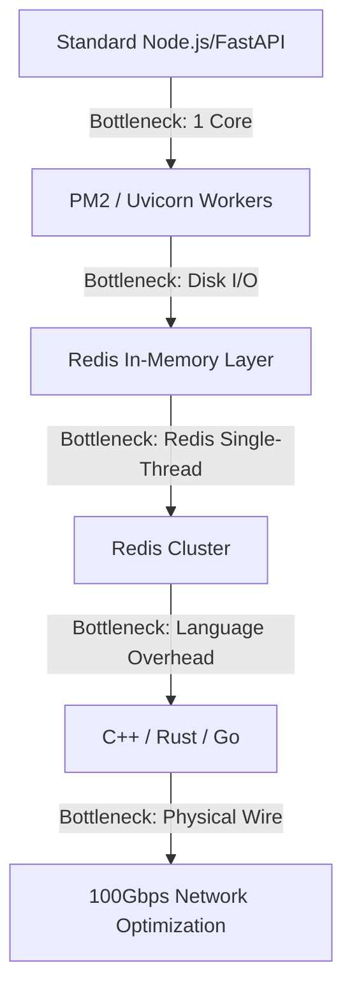

# Handling 1M Requests

This summary provides a comprehensive overview of the concepts covered in the video "Let’s Handle 1 Million Requests per Second, It’s Scarier Than You Think!", with a specific focus on the areas of pricing, cost-effectiveness, and memory performance that we discussed.

### **1. The Challenge of Scale**

- **Extreme Traffic:** Handling 1 million requests per second (RPS) is a "high-stakes environment" equivalent to the scale of Uber, Netflix, or Google.
- **Zero Room for Error:** At this scale, a simple inefficiency (like using an $O(n)$ algorithm instead of $O(\log n)$) can cost a company millions of dollars in a short period.
- **Resource Monitoring:** Achieving this scale requires constant monitoring of CPU, RAM, Disk, and Network Card performance.

### **2. Managed APIs vs. Self-Managed Infrastructure (User Emphasis)**

One of the most significant concepts covered is the **financial impact** of managed services at extreme scales. While convenient, they are often **not cost-effective** for 1 million RPS.

| Service Provider | Estimated Cost at 1M RPS (Monthly) | Significance [i] |
| --- | --- | --- |
| **OpenWeather API** | **$3.8 Billion** | Illustrates the "astronomical" cost of per-request fees. |
| **Amazon APIs** | **$3.9 Million** | Shows that even "reasonable" rates ($0.90/million calls) become massive. |
| **Cloudflare Workers** | **~$1 Million** | Demonstrates that serverless technology is expensive for constant high load. |
| **Self-Managed "Beast"** | **$8,000** | Running a high-end AWS C8GN server is far more justified. |

### **3. Memory Performance: Access vs. Read/Write Time (User Emphasis)**

As we discussed, moving data from disk to memory (RAM) is the primary way to solve database bottlenecks.

- **Read/Write Time:** This refers to the throughput speed. RAM is approximately **10 times faster** at reading and writing data than a standard disk.
- **Access Time:** This refers to latency. The sources state that the access time for RAM is **thousands of times faster** than disk.
- **The Bottleneck:** Traditional databases like PostgreSQL are limited by **Disk I/O**. Even the fastest SSD cannot keep up with 1 million writes per second.

### **4. Software Framework Performance**

The video benchmarks several technologies to see which can actually handle the 1M RPS milestone.

| Technology | Max RPS Observed (Approx.) | Note [i] |
| --- | --- | --- |
| **Express (Node.js)** | **~20,000** | High framework overhead; "too slow" for this scale. |
| **Fastify / Cpeak** | **~77,000** | Much faster; Cpeak offers raw Node.js performance. |
| **C++ (Drogon)** | **1,200,000** | The only technology that comfortably hit the 1M RPS goal for complex routes. |

### **5. Database Strategies and Redis**

- **PostgreSQL Limitations:** At 10 million records, simple SQL mistakes like `ORDER BY random()` can take **40 seconds** to respond. Scaling up disk speed (IOPS) is expensive and often yields diminishing returns.
- **Redis (In-Memory):**
    - **Single Instance:** Capped at roughly 100k–150k RPS.
    - **Clustering:** By running **Redis Clustering** (e.g., 30 clusters), you can bypass single-thread limits to achieve 1 million writes per second.
- **Real-World Pattern:** High-scale companies save data to **memory (Redis)** first and then **batch-sync** it to a persistent database (Postgres) in the background.

### **6. Networking and Hardware**

- **Network Bottlenecks:** At 1M RPS, you move so much data (e.g., 30KB per request) that you will hit **network card limits** (50 Gbps or higher) before you hit CPU limits.
- **The "Beast" Server:** The final tests used **AWS C8GN** instances with 192 CPU cores and **600 Gbps network bandwidth**.
- **Final Simulation Stats:** In the final 30-minute test using 60 "tester" machines, the system handled **2 billion requests** and moved **60 terabytes of data**.

---

*Note: The specific ratios of access time versus read/write time (10x vs 1,000x) are provided by the sources' simplified explanation of hardware performance. While these are standard engineering benchmarks, their exactness may vary based on specific hardware configurations, which I recommend verifying independently if needed.*

This is your comprehensive "System Architect’s Cheat Sheet" for the **1 Million RPS Challenge**. It is designed to be a technical reference you can return to whenever you need to refresh your mental model of high-scale systems.

---

## 🚀 The 1 Million RPS Master Summary

### 1. The Benchmarking Foundation

- **RPS (Throughput):** The total number of successful Request-Response cycles completed in 1 second.
    - *Formula:* $\text{Total Requests} / \text{Total Time (s)}$.
- **Latency:** The time it takes for a *single* request to go from client to server and back.
- **Autocannon Parameters:**
    - **Connections (`c`):** Total open TCP "pipes" between client and server.
    - **Pipelining (`p`):** Number of requests sent into a pipe without waiting for the previous response (increases stress/concurrency).
    - **Workers (`w`):** Number of threads the *tester* (Autocannon) uses to generate the massive traffic.

> **💡 Your Doubt Clarified:** RPS is the **result** of how fast the server answers the load Autocannon provides. Autocannon keeps the "pipeline" full; as soon as one response is received, it fires the next one immediately.
> 

---

### 2. CPU & Process Management

- **Single-Threaded Constraint:** Languages like Node.js (and Python) execute on a single core. To use a 128-core "Beast" server, you must scale horizontally *within* the machine.
- **Vertical Scaling (PM2/Uvicorn):** * Uses **Cluster Mode** to fork the main process.
    - 128 Cores = 128 Node.js instances.
    - The OS manages **Kernel Threads**, allowing one process container to utilize all hardware cores.

> **💡 Your Doubt Clarified:** While the OS might "hop" processes between cores (**Context Switching**), we run 1:1 (workers to cores) to minimize this overhead. Even though "essential OS tasks" exist, modern CPUs (via Hyper-threading) provide enough logical headroom to handle the background noise.
> 

| **Concept** | **Description** | **Visual Representation** |
| --- | --- | --- |
| **User vs Kernel Threads** | Node.js Worker Threads are **Kernel Threads**. The OS sees them and maps them to physical cores. | `[Process] -> [T1, T2, T3] -> [Core 1, Core 2, Core 3]` |
| **Concurrency vs Parallelism** | **Async/Asyncio** (Concurrency) handles waiting; **Workers/Clusters** (Parallelism) handles heavy computation. | `Async: 1 Chef, 4 Pans. Worker: 4 Chefs, 4 Kitchens.` |

---

### 3. Database & Memory Bottlenecks

The video demonstrates that as you scale, the bottleneck shifts: **Code → Network → Disk → CPU**.

- **The Database Wall:** Writing 1M times/sec to a Disk-based DB (PostgreSQL) is physically impossible/astronomically expensive due to Disk I/O limits.
- **The Redis Solution:** Use RAM. RAM access is **$\approx$ 1000x faster** than SSD.
- **The "Write-Behind" Pattern:**
    1. **Ingest:** Fire requests into **Redis (RAM)** at 1M/sec.
    2. **Queue:** Store IDs in a Redis List/Set.
    3. **Sync:** A background worker slowly "drains" Redis and batch-updates the SQL Database.
- **Redis Clustering:** A single Redis instance caps at $\approx$ 100k RPS. To hit 1M, you must use **Redis Cluster** (sharding data across multiple RAM instances).

---

### 4. The Extreme Scale: Network & C++

- **The Network Ceiling:** Even at 1M RPS, a 30KB JSON body moves **38 GB/s**. Standard 10Gbps network cards will melt. You need **100Gbps+ (AWS Beast Instances)**.
- **The Language Barrier:**
    - **Node.js/Python:** Great for most apps, but the overhead of the Garbage Collector and V8/Interpreter prevents hitting 1M RPS on a single machine for complex logic.
    - **C++ (Drogon Framework):** Used for the final win. It offers zero-overhead, manual memory management, and the fastest JSON parsers (**RapidJSON**).

---

## 📊 Visual Recap of Scaling Tiers

Code snippet

---

## 🧠 Memory Refresh: Your Specific Doubts

1. **Does RPS depend on Autocannon?** Yes. Autocannon is the *pressure*; RPS is how the server *withstands* it.
2. **Worker "At a Time":** It's not a batch; it's a **stream**. If pipeline is 6, there are always 6 requests in the air.
3. **PM2 vs. EC2:** PM2 = using all the "seats" in one car (Cores). EC2 = adding more cars to the road (Servers).
4. **CPU Core "Hopping":** The OS Scheduler moves threads between cores. We use 1 worker per core to keep the CPU "hot" and minimize nanoseconds lost during moves (**Context Switching**).
5. **JS Multithreading:** JS `worker_threads` are **Native Kernel Threads**. The OS can see them and put them on different cores, even though they belong to one "Node Process."

---

**Would you like me to create a specific "Cheat Sheet" for the Redis Cluster commands mentioned, or perhaps a breakdown of the C++ vs Node.js performance metrics?**
